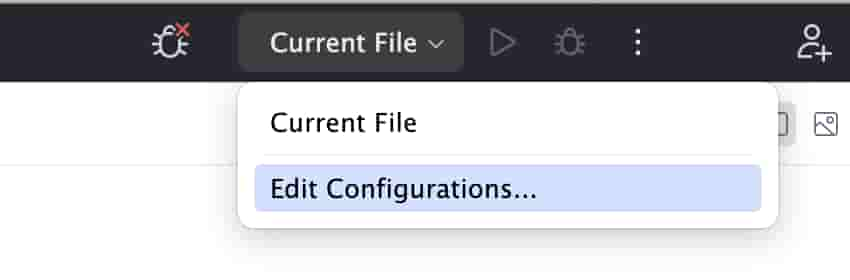
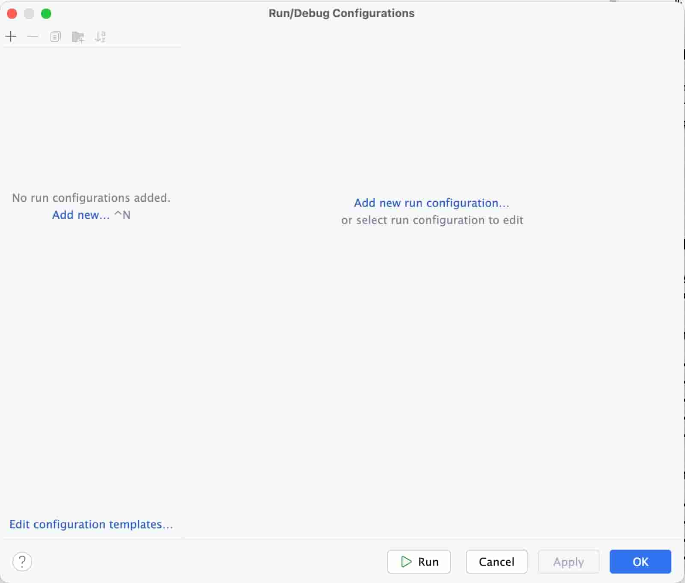
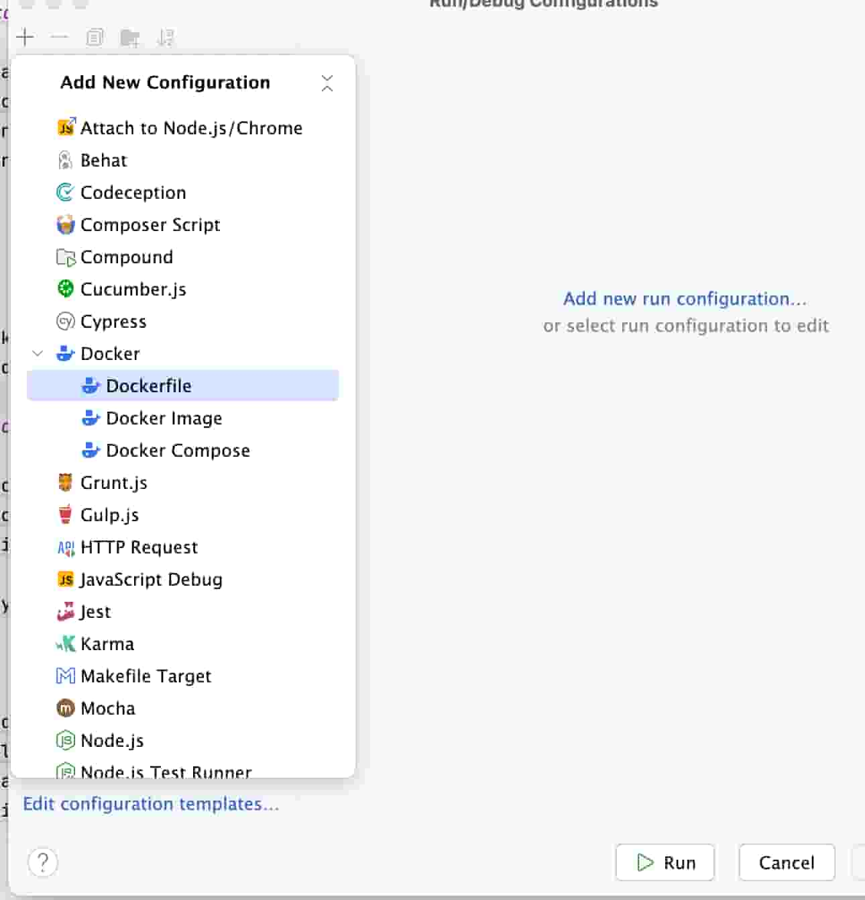

# Como configurar docker con xdebug en PhpStorm

## Inicio

Realizo este documento para tener una guía de cómo configurar Xdebug en PhpStorm, ya que cada vez que tengo que hacerlo, me olvido de cómo lo hice la última vez.
No es un documento oficial, es simplemente una guía que me sirve a mí y que comparto por si a alguien más le puede ser útil.

## Guía de configuración

- [Requisitos](#requisitos)
- [Configuración docker en PhpStorm](#configuración-docker-en-phpstorm)
- [Configurar intérprete](#configurar-intérprete)
- [Instalación de Xdebug](#instalación-de-xdebug)
- [Mapping de ficheros](#mapping-de-ficheros)
- [Configuración de Xdebug en PhpStorm](#configuración-de-xdebug-en-phpstorm)
- [Configuración de Phpunit en PhpStorm](#configuración-de-phpunit-en-phpstorm)

### Requisitos

- Docker*
- PhpStorm

>Importante recalcar que yo por normal general trabajo con **docker** en mis proyectos. 
Aunque no es un requisito para configurar Xdebug, lo hago por la comodidad de no tener que instalar porquería en mi equipo y por la facilidad de poder compartir el entorno de desarrollo con otros compañeros de equipo.
Además de las evidentes ventajas de tener un entorno de desarrollo idéntico al de producción.

### Configuración docker en PhpStorm

Hay dos formas para configurar docker en PhpStorm. Aunque la realidad es que puedes utilizar cualquiera de los dos métodos y el resultado va ser el mismo.

1. Lo primero es ir a la barra superior derecha y seleccionar `Edit Configurations...`

   

   Os saldrá una ventana como la siguiente:

   

   Simplemente tenéis que hacer click en el botón `+` y seleccionar `Docker-compose` o `Dockerfile` según vuestra configuración.

   
   2. **Docker-compose**: Si trabajas con docker-compose, puedes configurar tu entorno de desarrollo en PhpStorm de la siguiente forma:
   3. **Dockerfile**: Si trabajas con un Dockerfile, puedes configurar tu entorno de desarrollo en PhpStorm de la siguiente forma:

### Configurar intérprete

### Instalación de Xdebug

### Mapping de ficheros

### Configuración de Xdebug en PhpStorm

### Configuración de Phpunit en PhpStorm
